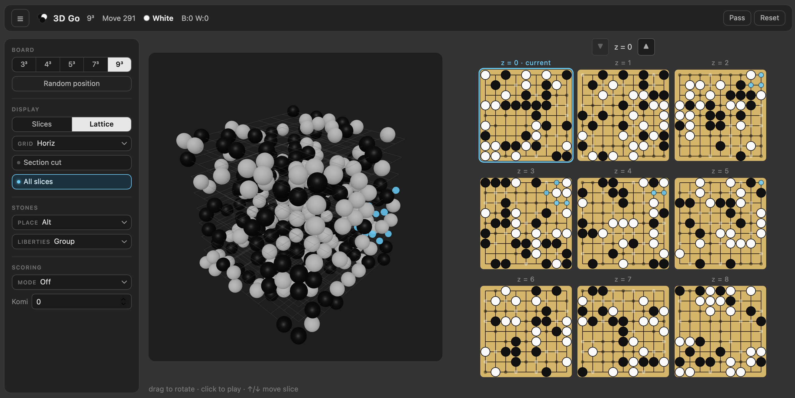
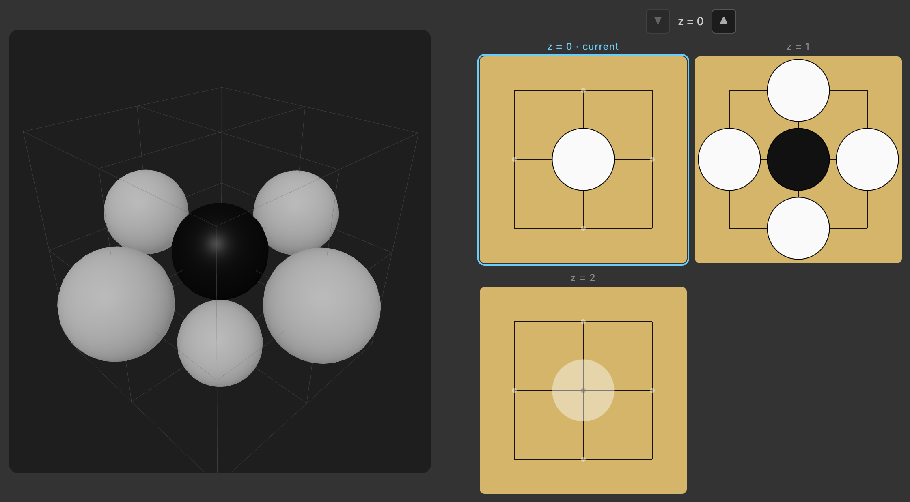
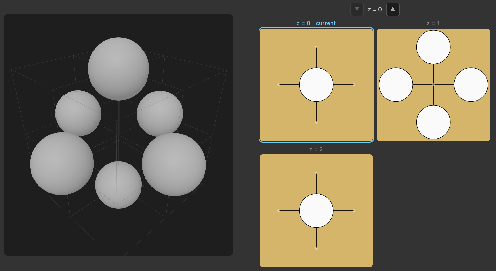

[](https://opensource.org/licenses/Apache-2.0)

# 3D Go

A research project exploring **3D Go**; Go played on an N×N×N lattice instead of a 2D grid. I find it pretty elegant that the rules are effectively unchanged from standard Go; only the topology differs: an interior intersection has **6 liberties** (±x, ±y, ±z) instead of 4. The goals are a correct engine, a human-playable UX for the hard-to-perceive lattice, and eventually a self-play AI, perhaps even a version that takes something like [autogo](https://github.com/ericjang/autogo) and builds a similar, simpler system based on alpha go to play this variant.

Built on a stripped fork of [online-go/goban](https://github.com/online-go/goban). Removed from upstream: OGS networking + protocol, the Canvas renderer, score estimator / autoscore, AI review, chat, all stone/board themes except `Plain`, the standalone engine-only build, the Jest test suite, typedoc, cspell, jscpd, and husky. The legacy 2D engine + SVG renderer remain -the 3D engine is built parallel to them rather than on top.

## Screenshots

A random 9³ position rendered in the interactive lattice view (left) with all nine z-slices shown on the right panel:



A 3³ board illustrating a 6-liberty atari — the lone black stone sits on the interior intersection of a 3³ cube and is surrounded by white on five of its six neighbors, leaving a single liberty:



After white plays the last liberty, the black group is captured and the prisoner count updates:



## Run

```
yarn install
yarn run dev     # http://localhost:9000/sandbox
```

Build commands (`yarn run build-debug` / `yarn run build-production`, also `make build`), lint (`yarn run lint`), formatting (`yarn run prettier[:check]`), and the combined `yarn run checks` are listed in `CLAUDE.md`. There is **no test runner** in this fork.

## Sandbox

The sandbox (`/sandbox`) is a single-page React app that plays 3D Go directly against a local `BoardState3D`. It has two views of the same game and a sidebar of tools.

**Views**

- **Lattice** — interactive three.js scene. Drag to rotate, click an intersection to play, ↑/↓ to move the slice cursor. A side panel shows the current slice (and its neighbors, or every slice if "All slices" is on) as 2D SVG mini-boards.
- **Slices** — every z-layer rendered as a 2D SVG goban in a grid, useful for seeing the whole position at once.

**Header**

- Brand mark — three overlapping go stones.
- Status — size (e.g. `4³`), move number, side to play (with stone dot), prisoner counts. Items collapse selectively on narrow screens.
- Actions — Pass, Reset. Sidebar toggle on the left.

**Sidebar**

- **Board** — size selector (3³ / 4³ / 5³ / 7³ / 9³) and a *Random position* button that fills ~40% of the cube with random legal alternating moves.
- **Display** — Slices/Lattice toggle, grid-line mode (All / Horiz / Vert / None, lattice only), Section cut toggle (lattice only — hides the half of the cube above the current slice), All slices toggle (lattice side panel).
- **Stones** — Place mode (Alt / Black-only / White-only, for setting up positions) and Liberties highlighting (Off / hover Group / all Black / all White).
- **Scoring** — Mode (Off / Estimate / Final) and Komi. *Estimate* is a live BFS influence heuristic; *Final* runs Tromp-Taylor area scoring and lets you click stones to toggle them dead, with a territory overlay on both views.

**Safety**

Destructive actions — reset, size change, random position — open a confirmation dialog when the board is non-empty. Esc cancels, Enter confirms.

**Responsive**

Layout adapts to screen width: at ≤900 px the sidebar stacks above the board as horizontal chips; at ≤600 px the brand collapses to just the icon, less essential header stats hide, and the lattice mount switches to a viewport-relative aspect.

## Architecture

One webpack build (`webpack.config.js`), `target: web`, entry `examples/main.tsx`, output `build/sandbox.{js,min.js}`. No separate Node build.

**Engine (`src/engine/`)** — cross-platform game logic, no DOM.

- `Topology.ts` — the seam between 2D and 3D. `Topology2D` (4 neighbors) and `Topology3D` (6 neighbors) own `forEachNeighbor`, `forEachPoint`, `idx`, `numPoints`.
- `BoardState3D.ts` — standalone 3D board, parallel to 2D `BoardState`: placement, 6-neighbor capture, suicide rejection, positional superko, liberty queries, `pass` / `clone` / `hashPosition`. Throws on illegal moves.
- `Scorer3D.ts` — Tromp-Taylor area scoring (`scoreTrompTaylor`, with optional manual-dead-stone removal) plus a live `estimateScoreInfluence` (BFS influence heuristic).
- The 2D classes (`BoardState`, `GobanEngine`, `MoveTree`, formats, `messages`) are retained but route neighbor enumeration through `Topology` so 2D and 3D share that one seam.

**Sandbox UI (`examples/`)** — `main.tsx` holds the `BoardState3D`, view state, and tool state; `lattice3d.ts` is the imperative three.js scene (mounted via `ResizeObserver`, so the canvas tracks the responsive layout). The legacy 2D renderer in `src/Goban/` is retained from upstream but unused by the sandbox.

See [docs/ARCHITECTURE.md](./docs/ARCHITECTURE.md) for the full internals.

## Docs

- [docs/ARCHITECTURE.md](./docs/ARCHITECTURE.md) — engine and sandbox internals.
- [docs/ROADMAP.md](./docs/ROADMAP.md) — what's done, what's next, key decisions, open questions.
- [docs/SCORING_PLAN.md](./docs/SCORING_PLAN.md) — the 3D scoring design (now implemented).
- [CLAUDE.md](./CLAUDE.md) — repo conventions and commands.
