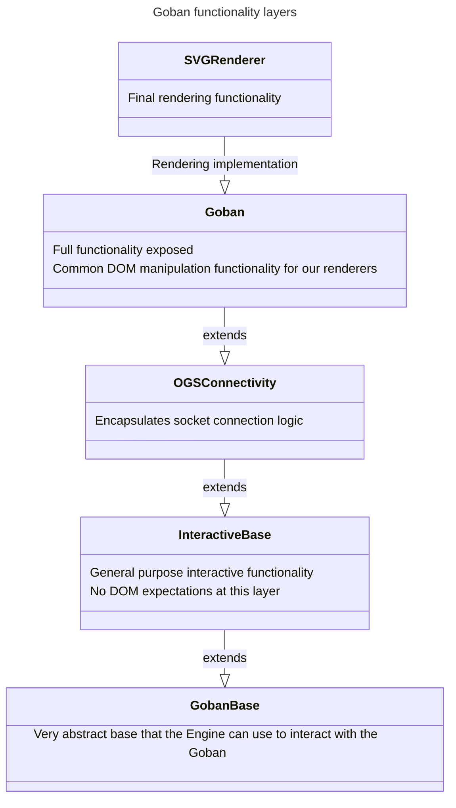

This directory contains the legacy 2D front-end `Goban` functionality, retained
from upstream. It is **not** used by the 3D sandbox (`examples/`), which renders
its own SVG slices and a three.js lattice — but it still builds and is the
reference for how the 2D renderer is structured. The `CanvasRenderer` was
removed in this fork; only the `SVGRenderer` remains.

The main class here is the `Goban` class, however because there is a lot of
code and functionality that get's bundled up into a `Goban`, we've broken up
that functionality across several files which implement different units of
functionality and we use class inheritance to stack them up to something
usable.

